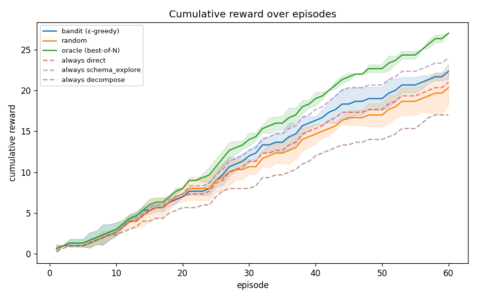
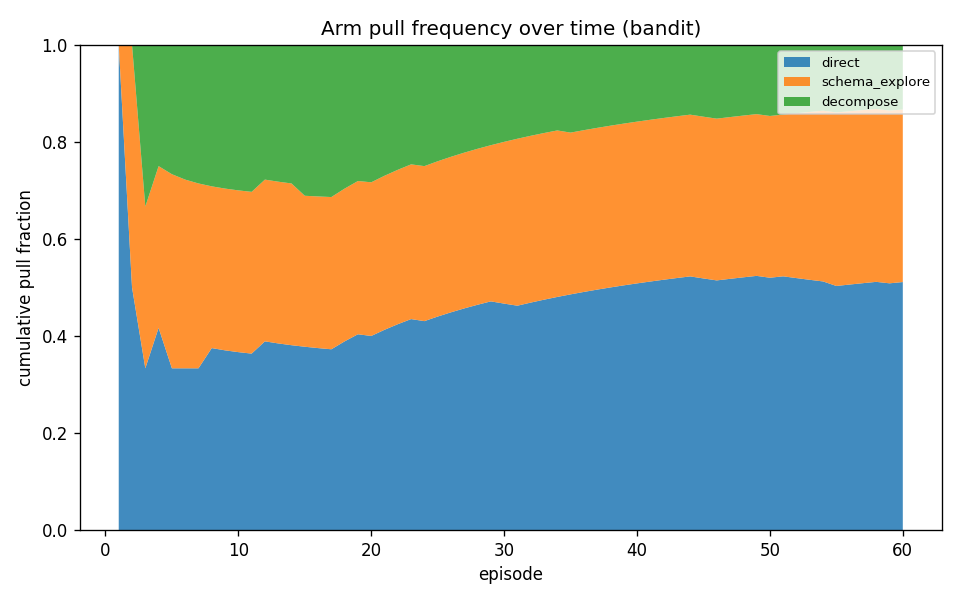
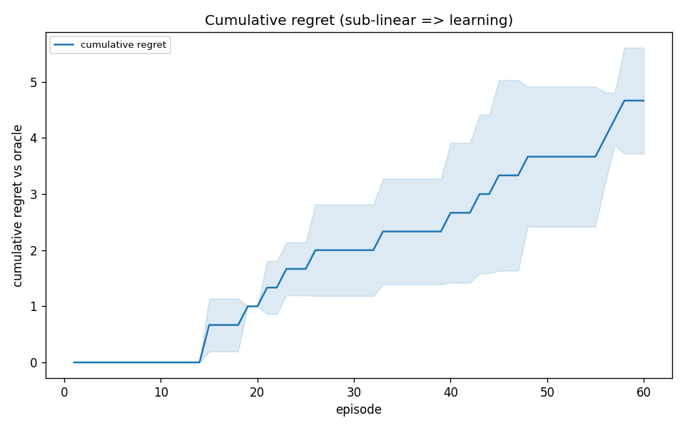
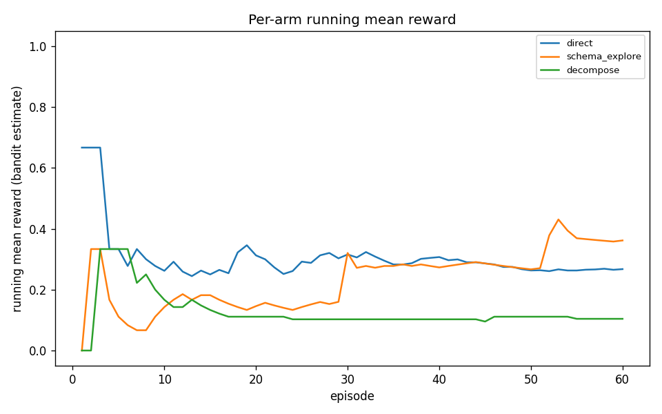

# AgentForge

**A self-improving workflow selector for text-to-SQL.**

AgentForge learns *which* of three fixed SQL-generation workflows to deploy for a given
text-to-SQL task. An ε-greedy multi-armed bandit improves its selection policy online over
repeated episodes, using a binary execution-correctness reward on the
[BIRD-SQL](https://bird-bench.github.io/) benchmark.

> Stanford CS 153 (Frontier Systems), Spring 2026 · solo project · Track: Automation / Agent Systems.

## What's the contribution?

A **learned policy at the workflow-selection layer** of an agent system — a layer where selection
is usually hardcoded or heuristic. The framing matters:

- **Selector, not a self-rewriting agent.** The bandit makes *one discrete selection decision per
  task*. It does not modify workflow internals.
- **Bandit, not RL.** Selection is a one-step decision with no sequential credit assignment.
- **Composition-novel, not algorithm-novel.** ε-greedy is textbook; the contribution is a learned
  selector over *multi-step workflow compositions*. The closest commercial analogs are LLM routers
  (RouteLLM, Martian, Not Diamond) — the distinguishing claim is selecting among multi-step
  *workflows*, not swapping a single model.

## The three workflow arms

All arms share one interface — `run(task, llm) -> WorkflowResult` — so the bandit treats them as
interchangeable actions:

| # | Arm | Strategy | Wins when… |
|---|-----|----------|------------|
| 0 | `direct` | Single LLM call: schema + question → SQL | the task is straightforward |
| 1 | `schema_explore` | Identify relevant tables, then write SQL against that subset | the schema is large/messy |
| 2 | `decompose` | Split into sub-questions → sub-SQL → compose | multi-join / nested queries |

**Reward:** execute candidate SQL and gold SQL on the task's SQLite DB; reward = 1 if the result
sets match (order-insensitive), else 0. Errors and timeouts score 0.

## Setup

```bash
python3 -m venv .venv && source .venv/bin/activate
pip install -r requirements.txt
cp .env.example .env        # then add ANTHROPIC_API_KEY (or OPENAI_API_KEY)
```

The Anthropic SDK reads `ANTHROPIC_API_KEY` and (if set) `ANTHROPIC_BASE_URL` from the environment.
Defaults (provider, model `claude-sonnet-4-6`, ε, episode count) live in [`src/config.py`](src/config.py).

## Quickstart — verify the pipeline offline (no API key, no download)

A scripted fake-LLM dry run exercises the entire pipeline against a tiny synthetic fixture, with
the arms deliberately differentiated so the bandit has something to learn:

```bash
python -m scripts.dry_run                      # writes logs/dry_*.jsonl
python -m scripts.plot_results --prefix dry     # writes plots/dry_*.png + summary
python -m unittest tests.test_pipeline          # 17 offline tests
```

Expected: the bandit converges on `schema_explore` (the designed-best arm), tracking just under the
oracle and beating random + every single-arm baseline.

## Run the real experiment

```bash
# 1. Data — download + unpack the BIRD dev set into data/bird/ (~346 MB zip)
python -m scripts.download_bird

# 2. Provider — copy .env.example to .env and add your key:
#      AGENTFORGE_PROVIDER=openrouter
#      OPENROUTER_API_KEY=sk-or-...
#      AGENTFORGE_OPENROUTER_MODEL=openai/gpt-4o-mini

# 3. Smoke test (spec §11.1 gate): confirm the arms are differentiated
python -m scripts.smoke_test --provider openrouter --n 20

# 4. Bandit + baselines + oracle across seeds (balanced pool, shared cache)
python -m scripts.run_real --n-episodes 60 --seeds 0,1,2 --prefix exp

# 5. The four evaluation plots + per-arm summary table
python -m scripts.plot_results --prefix exp
```

`run_real` builds a difficulty/database-balanced task pool and warms the cache oracle-first. A
provider-agnostic path also exists via `scripts.run_experiment` + `scripts.run_baselines` (see
`--help`). Temperature 0 + the SQLite response cache make re-runs deterministic and free.

## Results

Model `openai/gpt-4o-mini` via OpenRouter · 60 episodes × 3 seeds · BIRD dev
(california_schools, financial, formula_1, superhero). The mid-tier model is deliberate — it
leaves headroom for *workflow strategy* to matter; a frontier model solves nearly everything and
collapses the selection signal.

| | |
|---|---|
|  |  |
|  |  |

**Takeaway:** across 3 seeds × 60 episodes, the bandit shifts selection mass off the harmful
`decompose` arm (from ~33% at forced-init down to ~13% of pulls) and onto the two effective
workflows (`direct` + `schema_explore`, ~87% combined). Cumulative reward reaches **22.3** —
above **random (20.3)** and **always-decompose (17.0)**, competitive with the best single arm
**always-schema_explore (24.0)**, and approaching the post-hoc **oracle (27.0)**. Honest caveat:
on this distribution `direct` (0.39) and `schema_explore` (0.41) are statistically tied
(overlapping Wilson CIs), so the headroom over "always pick the best arm" is small — the decisive
win is learning *online* to avoid the weak arm without being told the ranking up front; regret
grows sub-linearly. Per-arm pulls / success rates / Wilson CIs in
[`results/exp_summary.txt`](results/exp_summary.txt).

What each plot shows:
1. **Cumulative reward** — bandit vs random vs single-arm vs oracle (mean ± std across seeds).
2. **Arm pull frequency over time** — selection mass shifting toward the better arms.
3. **Cumulative regret vs. oracle** — sub-linear growth ⇒ the bandit is learning.
4. **Per-arm running mean reward** — the bandit's value estimates separating.

## Repository layout

```
src/
  config.py        constants: ε, episodes, model, paths, arm names (stable order)
  tasks.py         BIRD loader + Task dataclass
  schema.py        load / format / filter SQLite schema for prompts
  llm.py           Anthropic|OpenAI wrapper + SQLite response cache + FakeLLMClient
  bandit.py        ε-greedy policy + per-arm value estimates
  executor.py      read-only SQL execution with timeout
  reward.py        binary execution-match
  logger.py        JSONL episode logging (canonical schema)
  episode.py       one episode: select → run → reward → update → log
  experiment.py    shared loops: bandit / random / single-arm / oracle
  metrics.py       log → series (rolling acc, pull fractions, regret, Wilson CI)
  workflows/       base.py, prompts.py, direct.py, explore.py, decompose.py
scripts/           download_bird, make_fixture, dry_run, smoke_test,
                   run_experiment, run_baselines, plot_results
tests/             offline unit + integration tests
data/  logs/  plots/  docs/
```

## Logging format (JSONL)

One JSON object per episode, one file per run at `logs/{run_id}.jsonl`. Stable fields:
`run_id, episode_idx, timestamp, seed, task_id, db_id, question, difficulty, selected_arm,
workflow_name, selection_reason, generated_sql, gold_sql, reward, exec_match, execution_error,
latency_ms, llm_calls, tokens_used, arm_means_after, arm_counts_after, epsilon, model`.

## Reproducibility

Seeds are set and logged; LLM temperature is 0; episodes run sequentially. LLM responses are cached
by `(model, system, prompt, temperature, max_tokens)` in `llm_cache.sqlite`, so re-runs don't re-pay
the API and logged token counts stay stable. Some residual API non-determinism remains even at
temperature 0 (documented in the writeup).

## Scope (MVP)

Deliberately *not* in the MVP: a 4th critic-loop arm, cost-adjusted reward, contextual bandits, a
second domain (config stub only), and any agent framework (LangGraph/DSPy/LangChain). See
[`docs/agentforge_spec.md`](docs/agentforge_spec.md) §14 for the full out-of-scope list.

## Related work

AFlow, DSPy, Voyager, Reflexion, Self-Refine, DIN-SQL, DAIL-SQL, RouteLLM.

## AI-use disclosure

Per course policy: this repository was implemented with substantial assistance from **Claude Code**
(Anthropic). Claude Code scaffolded the module structure, wrote the workflow / bandit / executor /
reward / logging / plotting code and tests from the project specification (`docs/agentforge_spec.md`),
and generated the synthetic fixture and offline verification harness. The project design, the
specification, and all framing decisions are the author's. AI-generated code was reviewed and
verified by the author (offline test suite + dry-run before any API spend).
