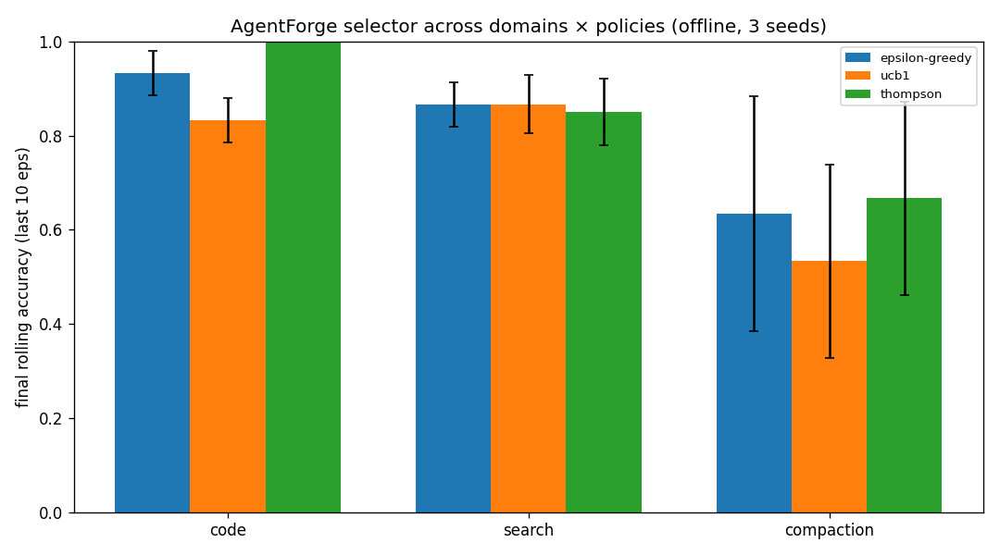
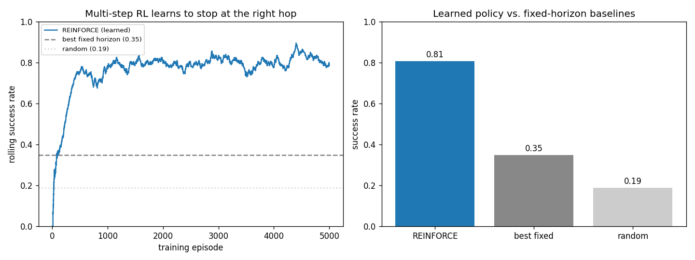

# AgentForge

**A learned selection layer for agentic workflows — drop-in self-improvement for any agent's turn.**

Agents usually hardcode *how* they act each turn. AgentForge makes that choice **learnable**: give it
a few strategies and a cheap success signal, and an online multi-armed bandit learns which strategy
wins on your tasks and concentrates selection there — improving across runs. Think of it as a harness
for choosing your harness's strategy.

Two things live in this repo:
- **The reusable kernel** — [`WorkflowSelector`](src/selector.py): bring your own strategies + reward
  signal; it learns online which to use. Domain-agnostic — [jump to the quickstart](#use-it-on-your-own-agent).
- **The proof** — a text-to-SQL case study on [BIRD-SQL](https://bird-bench.github.io/): an ε-greedy
  bandit selects among three SQL-generation workflows, rewarded by binary execution-match.

> Stanford CS 153 (Frontier Systems), Spring 2026 · solo project · Track: Automation / Agent Systems.

## What's the contribution?

A **learned policy at the workflow-selection layer** of an agent system — a layer where selection
is usually hardcoded or heuristic. The framing matters:

- **Selector, not a self-rewriting agent.** The bandit makes *one discrete selection decision per
  task*. It does not modify workflow internals.
- **Bandit, not RL.** Selection is a one-step decision with no sequential credit assignment.
- **Composition-novel, not algorithm-novel.** ε-greedy is textbook; the contribution is a learned
  selector over *multi-step workflow compositions*. The closest commercial analogs are LLM routers
  (RouteLLM, Martian, Not Diamond) — the distinguishing claim is selecting among multi-step
  *workflows*, not swapping a single model.

## Use it on your own agent

The selector is domain-agnostic. Install the package and wrap your own strategies:

```bash
pip install -e .
```

```python
from agentforge import WorkflowSelector

selector = WorkflowSelector(
    arms={"fast": fast_fn, "careful": careful_fn, "use_tools": tool_fn},
    reward=lambda task, out: 1.0 if passes(out) else 0.0,  # tests / eval / 👍 / exec-match
    policy="epsilon-greedy",         # or "ucb1"
    persist="selector_state.json",   # learns across runs, not just one session
)

result = selector.run(task)          # picks a strategy, runs it, scores it, updates
print(selector.stats(), "->", selector.best())
```

Each arm is any `task -> output` callable — a prompt variant, a tool-use pattern, a different model,
or a whole multi-step workflow. The reward is any `(task, output) -> [0,1]` signal you already have.

**Runnable non-SQL demo** — the same selector learning which *prompting strategy* wins on multi-step
word problems (no SQL, no BIRD):

```bash
python -m examples.byo_agent --fake     # offline, deterministic, no API key
python -m examples.byo_agent            # live via OpenRouter
```
```
direct: 0.33 (n=3)   cot: 1.00 (n=27)   ->  selector learned to prefer: cot
```

**When it helps** (a lesson from our own BIRD run): use it when your strategies genuinely differ and
you have a cheap automatic signal — it finds the winner and drops the losers. If they're statistically
tied, it surfaces that too, so you can cut the complexity. No magic when there's nothing to learn.

## How it compares

Agent SDKs let you *write* how an agent acts; some let you *measure* it. **None learns, online, which
strategy works per task from your own reward, and persists it across runs.** That four-way gap is
where AgentForge sits. Full sourced analysis: [docs/POSITIONING.md](docs/POSITIONING.md).

| | Online + persists | Policy over multi-step workflows | Your reward signal | SDK |
|---|:---:|:---:|:---:|:---:|
| Orchestration SDKs (Google ADK, OpenAI Agents, MS Agent Framework, LangGraph, CrewAI) | ✗ | ✗ | eval/trace only | ✓ |
| Optimizers (DSPy/GEPA, TextGrad, Trace) | ✗ (offline) | ✗ (one program's prompts/params) | metric | ✓ |
| Model routers (RouteLLM, Not Diamond, Martian) | ~ (mostly offline) | ✗ (one model, single turn) | preference | ✓ |
| **ARC** — closest relative (arXiv:2602.11574) | ✗ (offline PPO, frozen) | ✓ | α·correct−cost | ✗ (research) |
| **AgentForge** | **✓** | **✓** | **your callback** | **✓** |

We're *"ARC, but online, persistent, and productized,"* and **complementary** to DSPy/GEPA
(offline-optimize each arm, then let AgentForge select among them online).

## The learning ladder & domains

The same `WorkflowSelector` spans a ladder of policies (swap `policy=`) and four domains —
demonstrating that the learned selection layer is genuinely domain-agnostic.

**Policies, low → high** (all offline-verified in `tests/`):

| policy | learns | headline result |
|---|---|---|
| `epsilon-greedy` / `ucb1` / `thompson` | best arm *on average* | learns the winner in every domain |
| `linucb` (contextual) | best arm *per task* (featurized context) | **1.00 vs ~0.50** for average-case bandits on context-dependent tasks |
| `REINFORCE` (multi-step) | a *trajectory* control policy ("iterate-or-stop") | **0.81 vs 0.35** best fixed-horizon, 0.19 random (2.3×) |

**Domains** (each = arms + a reward plugged into the selector):

| domain | arms | reward | best arm learned |
|---|---|---|---|
| text-to-SQL (BIRD) | direct / schema-explore / decompose | execution-match | schema_explore |
| code generation | direct / iterative-repair / decompose | unit tests pass | iterative |
| agentic search | keyword / iterative / broad→narrow | file match | iterative |
| context compaction* | truncate / extractive / hierarchical | downstream QA survives | hierarchical |

<sub>*compaction arms adapted from [ee392c-agent-mem](https://github.com/ms-d-kim/ee392c-agent-mem) (Kim & Guernsey); we add the downstream-QA reward it lacked.</sub>




Everything above runs **offline with a fake LLM** (no API key):

```bash
python -m examples.code_domain --fake        # or search_domain / compaction_domain / byo_agent
python -m examples.rl_multihop --plot         # multi-step RL learning curve
python -m scripts.sweep                       # cross-domain × policy matrix
```

Adversarial verification of these claims: [docs/VERIFICATION.md](docs/VERIFICATION.md).
Competitive positioning: [docs/POSITIONING.md](docs/POSITIONING.md).

## The three workflow arms (the BIRD case study)

All arms share one interface — `run(task, llm) -> WorkflowResult` — so the bandit treats them as
interchangeable actions:

| # | Arm | Strategy | Wins when… |
|---|-----|----------|------------|
| 0 | `direct` | Single LLM call: schema + question → SQL | the task is straightforward |
| 1 | `schema_explore` | Identify relevant tables, then write SQL against that subset | the schema is large/messy |
| 2 | `decompose` | Split into sub-questions → sub-SQL → compose | multi-join / nested queries |

**Reward:** execute candidate SQL and gold SQL on the task's SQLite DB; reward = 1 if the result
sets match (order-insensitive), else 0. Errors and timeouts score 0.

## Setup

```bash
python3 -m venv .venv && source .venv/bin/activate
pip install -r requirements.txt
cp .env.example .env        # then add ANTHROPIC_API_KEY (or OPENAI_API_KEY)
```

The Anthropic SDK reads `ANTHROPIC_API_KEY` and (if set) `ANTHROPIC_BASE_URL` from the environment.
Defaults (provider, model `claude-sonnet-4-6`, ε, episode count) live in [`src/config.py`](src/config.py).

## Quickstart — verify the pipeline offline (no API key, no download)

A scripted fake-LLM dry run exercises the entire pipeline against a tiny synthetic fixture, with
the arms deliberately differentiated so the bandit has something to learn:

```bash
python -m scripts.dry_run                      # writes logs/dry_*.jsonl
python -m scripts.plot_results --prefix dry     # writes plots/dry_*.png + summary
python -m unittest tests.test_pipeline          # 17 offline tests
```

Expected: the bandit converges on `schema_explore` (the designed-best arm), tracking just under the
oracle and beating random + every single-arm baseline.

## Run the real experiment

```bash
# 1. Data — download + unpack the BIRD dev set into data/bird/ (~346 MB zip)
python -m scripts.download_bird

# 2. Provider — copy .env.example to .env and add your key:
#      AGENTFORGE_PROVIDER=openrouter
#      OPENROUTER_API_KEY=sk-or-...
#      AGENTFORGE_OPENROUTER_MODEL=openai/gpt-4o-mini

# 3. Smoke test (spec §11.1 gate): confirm the arms are differentiated
python -m scripts.smoke_test --provider openrouter --n 20

# 4. Bandit + baselines + oracle across seeds (balanced pool, shared cache)
python -m scripts.run_real --n-episodes 60 --seeds 0,1,2 --prefix exp

# 5. The four evaluation plots + per-arm summary table
python -m scripts.plot_results --prefix exp
```

`run_real` builds a difficulty/database-balanced task pool and warms the cache oracle-first. A
provider-agnostic path also exists via `scripts.run_experiment` + `scripts.run_baselines` (see
`--help`). Temperature 0 + the SQLite response cache make re-runs deterministic and free.

## Results

Model `openai/gpt-4o-mini` via OpenRouter · 60 episodes × 3 seeds · BIRD dev
(california_schools, financial, formula_1, superhero). The mid-tier model is deliberate — it
leaves headroom for *workflow strategy* to matter; a frontier model solves nearly everything and
collapses the selection signal.

| | |
|---|---|
|  |  |
|  |  |

**Takeaway:** across 3 seeds × 60 episodes, the bandit shifts selection mass off the harmful
`decompose` arm (from ~33% at forced-init down to ~13% of pulls) and onto the two effective
workflows (`direct` + `schema_explore`, ~87% combined). Cumulative reward reaches **22.3** —
above **random (20.3)** and **always-decompose (17.0)**, competitive with the best single arm
**always-schema_explore (24.0)**, and approaching the post-hoc **oracle (27.0)**. Honest caveat:
on this distribution `direct` (0.39) and `schema_explore` (0.41) are statistically tied
(overlapping Wilson CIs), so the headroom over "always pick the best arm" is small — the decisive
win is learning *online* to avoid the weak arm without being told the ranking up front; regret
grows sub-linearly. Per-arm pulls / success rates / Wilson CIs in
[`results/exp_summary.txt`](results/exp_summary.txt).

What each plot shows:
1. **Cumulative reward** — bandit vs random vs single-arm vs oracle (mean ± std across seeds).
2. **Arm pull frequency over time** — selection mass shifting toward the better arms.
3. **Cumulative regret vs. oracle** — sub-linear growth ⇒ the bandit is learning.
4. **Per-arm running mean reward** — the bandit's value estimates separating.

## Repository layout

```
src/
  config.py        constants: ε, episodes, model, paths, arm names (stable order)
  tasks.py         BIRD loader + Task dataclass
  schema.py        load / format / filter SQLite schema for prompts
  llm.py           Anthropic|OpenAI wrapper + SQLite response cache + FakeLLMClient
  bandit.py        ε-greedy policy + per-arm value estimates
  executor.py      read-only SQL execution with timeout
  reward.py        binary execution-match
  logger.py        JSONL episode logging (canonical schema)
  episode.py       one episode: select → run → reward → update → log
  experiment.py    shared loops: bandit / random / single-arm / oracle
  metrics.py       log → series (rolling acc, pull fractions, regret, Wilson CI)
  workflows/       base.py, prompts.py, direct.py, explore.py, decompose.py
scripts/           download_bird, make_fixture, dry_run, smoke_test,
                   run_experiment, run_baselines, plot_results
tests/             offline unit + integration tests
data/  logs/  plots/  docs/
```

## Logging format (JSONL)

One JSON object per episode, one file per run at `logs/{run_id}.jsonl`. Stable fields:
`run_id, episode_idx, timestamp, seed, task_id, db_id, question, difficulty, selected_arm,
workflow_name, selection_reason, generated_sql, gold_sql, reward, exec_match, execution_error,
latency_ms, llm_calls, tokens_used, arm_means_after, arm_counts_after, epsilon, model`.

## Reproducibility

Seeds are set and logged; LLM temperature is 0; episodes run sequentially. LLM responses are cached
by `(model, system, prompt, temperature, max_tokens)` in `llm_cache.sqlite`, so re-runs don't re-pay
the API and logged token counts stay stable. Some residual API non-determinism remains even at
temperature 0 (documented in the writeup).

## Scope: MVP → v2

The **MVP** was deliberately tight — one domain (BIRD-SQL), three fixed arms, an ε-greedy bandit — to
prove the selection layer cleanly (see [`docs/agentforge_spec.md`](docs/agentforge_spec.md) §14).
**v2** then extended it into a reusable SDK: the contextual (LinUCB) and multi-step (REINFORCE) rungs,
three more domains (code / search / compaction), and pip packaging. Still *not* built (future work):
cost-adjusted reward, a 4th critic-loop arm, learnable workflows, and any heavyweight agent framework —
AgentForge is the selection layer that sits *above* those.

## Related work

AFlow, DSPy, Voyager, Reflexion, Self-Refine, DIN-SQL, DAIL-SQL, RouteLLM.

## AI-use disclosure

Per course policy: this repository was implemented with substantial assistance from **Claude Code**
(Anthropic). Claude Code scaffolded the module structure, wrote the workflow / bandit / executor /
reward / logging / plotting code and tests from the project specification (`docs/agentforge_spec.md`),
and generated the synthetic fixture and offline verification harness. The project design, the
specification, and all framing decisions are the author's. AI-generated code was reviewed and
verified by the author (offline test suite + dry-run before any API spend).
